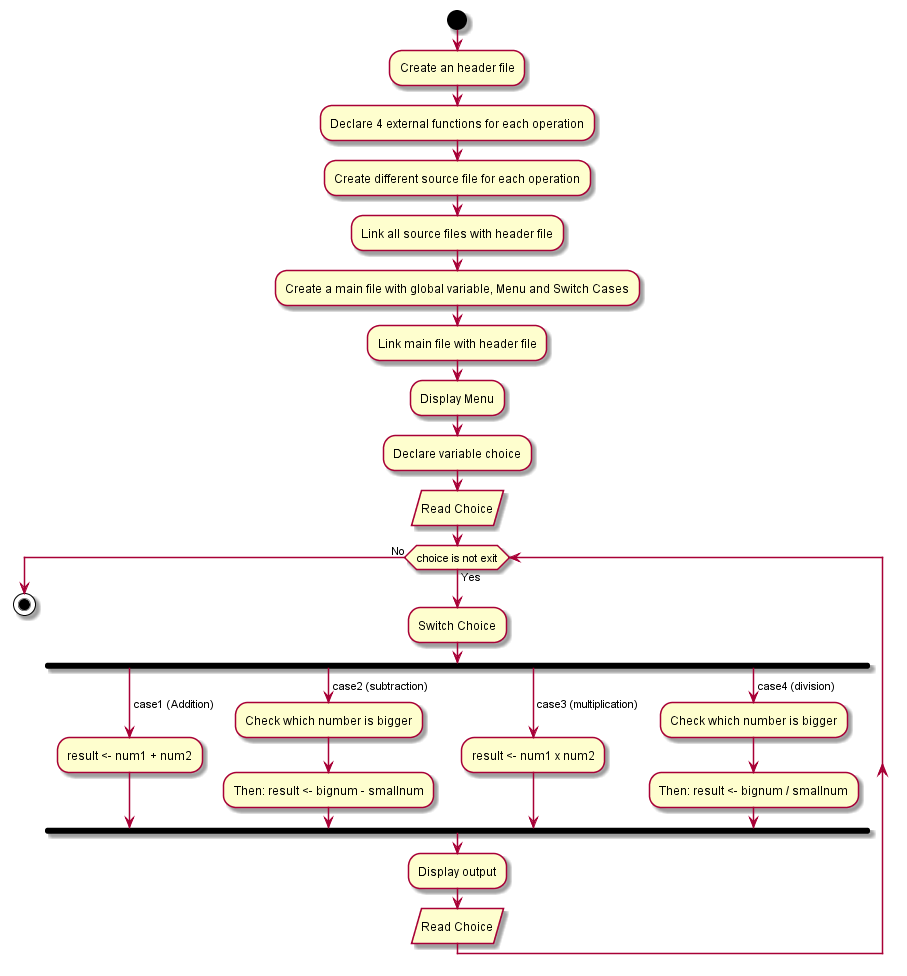

# Simple-Calculator
- Objective:

    To create a simple arithmetic operational calculator using Extern Keyword.

The repository consists of following directories:
- Assets:

    Assets are flowchart files. We created our flowchart for the task using Plantuml and stored it here.

- Docs:

    It contains various issues we faced while developing Source for the given task. It is useful for future purpose while debugging an same kind of issue.

- Src:

    It contains our task's source. We can pull this source and work with it on any required time

The following is the Flowchart for the task:

- Version:

    Simple Calculator Version_v1.1.0